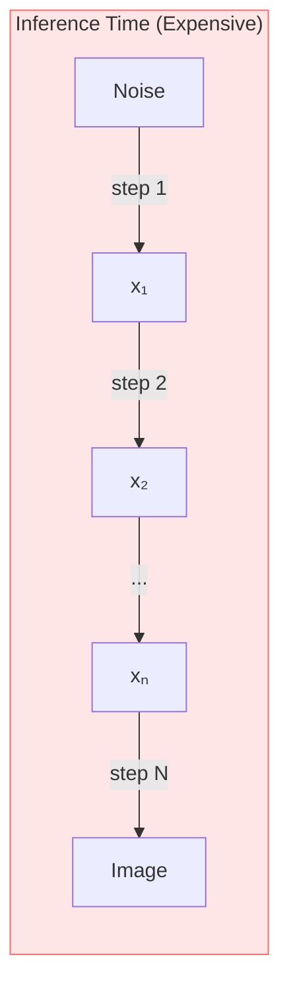
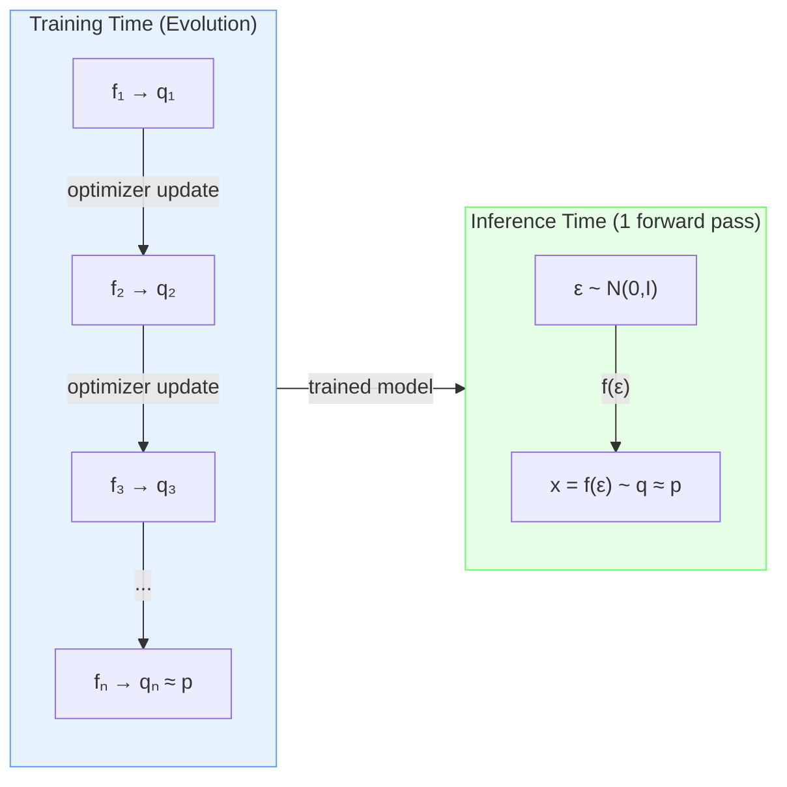
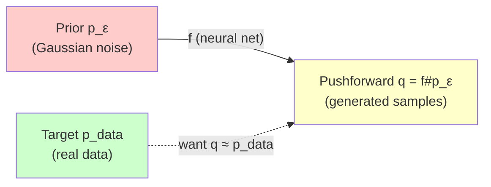
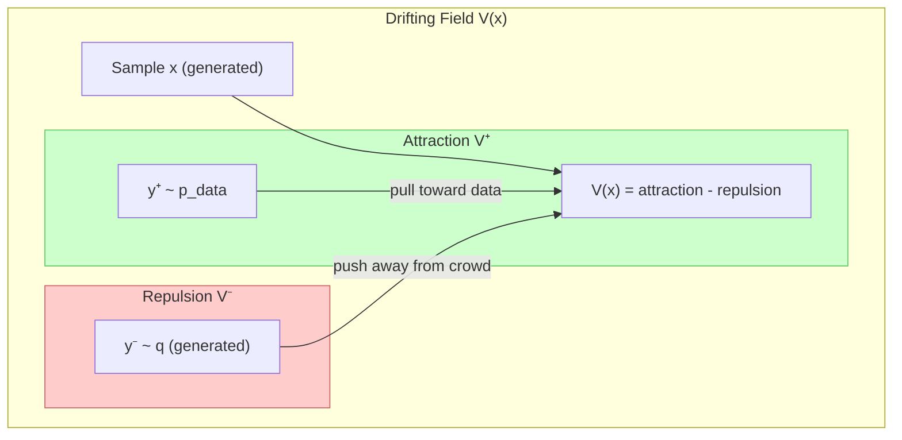
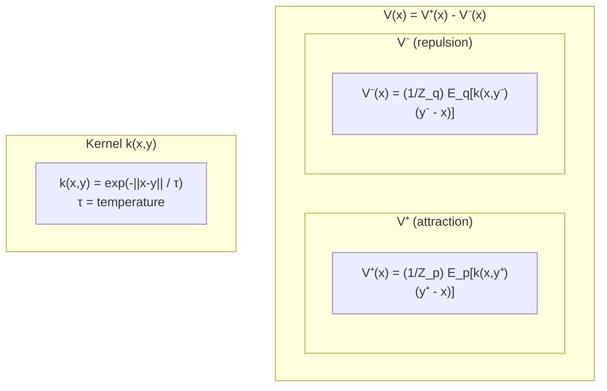
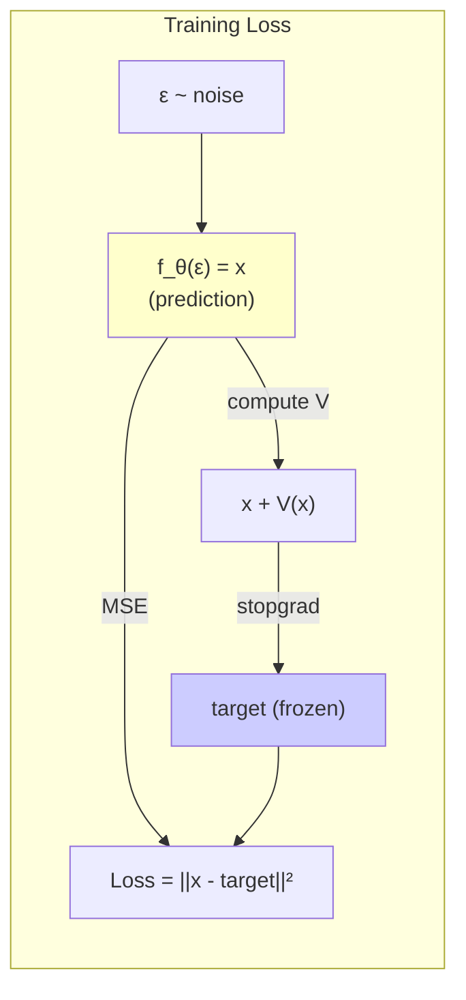
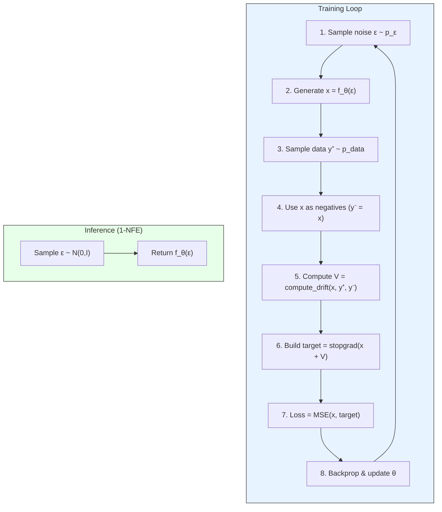
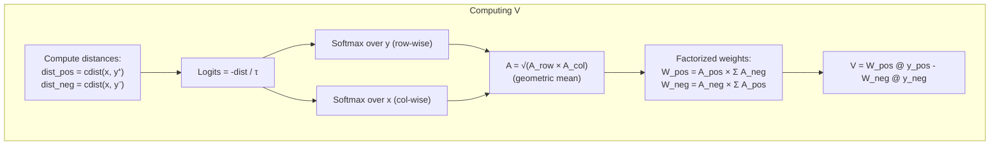
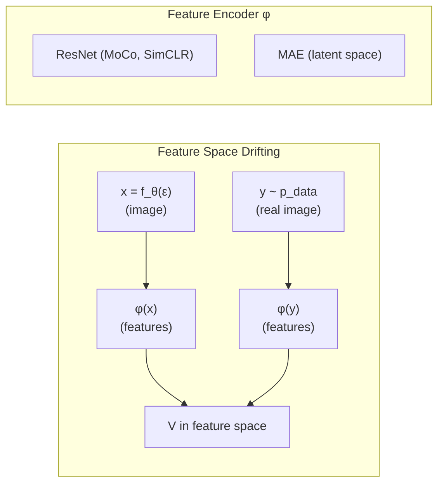
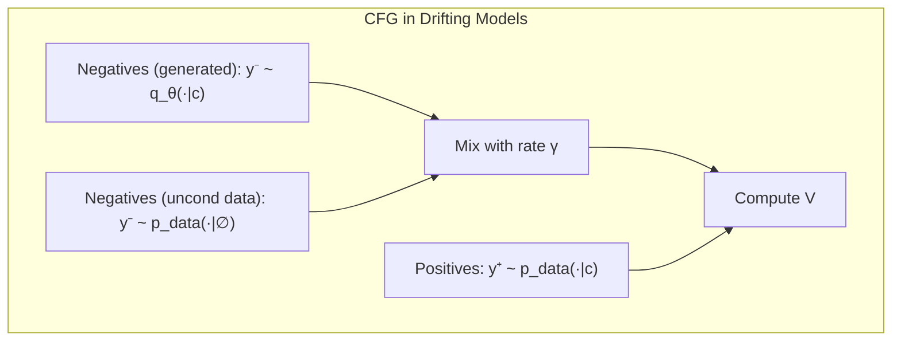

# Drifting Models: A New Paradigm for One-Step Generative Modeling

> **Paper**: "Generative Modeling via Drifting" by Deng et al. (ICML 2026, MIT & Harvard)
> 
> **Key Innovation**: Train a generator that evolves its output distribution *during training*, enabling **one-step inference** (1-NFE) without iterative denoising.

---

## Executive Summary

Drifting Models offer a fundamentally different approach to generative modeling compared to diffusion/flow-based methods:

| Aspect | Diffusion/Flow Models | Drifting Models |
|--------|----------------------|-----------------|
| **When distribution evolves** | At inference (multi-step) | At training |
| **Inference cost** | N iterations (expensive) | 1 forward pass (cheap) |
| **Core mechanism** | Numerical ODE/SDE solving | Drifting field V → 0 at equilibrium |
| **State-of-the-art** | FID ~1.4-2.0 (multi-step) | FID 1.54 (1-NFE) on ImageNet 256×256 |

---

## The Core Idea: Training-Time Distribution Evolution

### The Problem with Traditional Generative Models

Traditional diffusion/flow models do iterative refinement **at inference**:

### Drifting Models: Evolve During Training

Drifting models move the "iteration" to **training time**:

---

## Key Concepts Explained

### 1. Pushforward Distribution

The **pushforward** is simply "what happens to a distribution when you pass it through a function":

**Goal**: Find f such that **q = f#pε ≈ pdata**

### 2. The Drifting Field V

The drifting field tells each sample **where to move** to better match the data distribution:

**Intuition**: 
- **Attraction** (V⁺): Move toward nearby data points
- **Repulsion** (V⁻): Spread out from other generated samples
- At **equilibrium** (q = p): forces balance → **V = 0**

### 3. The Anti-Symmetry Property

The key mathematical insight: if the drifting field is **anti-symmetric**, then distributions matching implies zero drift:

$$V_{p,q}(x) = -V_{q,p}(x) \quad \forall x$$

$$\Rightarrow \quad q = p \implies V_{p,q}(x) = 0 \quad \forall x$$

**Proof**: If q = p, then V_{p,q} = V_{q,p} = -V_{p,q} → V_{p,q} = 0

---

## The Drifting Field Formula

### Mean-Shift Formulation

The drifting field uses kernel-weighted mean-shift:

### Compact Form (Used in Implementation)

Combining the two terms:

$$V_{p,q}(x) = \frac{1}{Z_p Z_q} \mathbb{E}_{y^+ \sim p, y^- \sim q}\left[ k(x, y^+) \cdot k(x, y^-) \cdot (y^+ - y^-) \right]$$

This is **anti-symmetric** because swapping y⁺ ↔ y⁻ flips the sign of (y⁺ - y⁻).

---

## The Training Loss

### Fixed-Point Formulation

At equilibrium, samples should stay put: **x = x + V(x)** when V = 0.

Training uses a **stop-gradient** trick (similar to self-supervised learning):

$$\mathcal{L} = \mathbb{E}_\epsilon\left[ \left\| f_\theta(\epsilon) - \text{stopgrad}\left(f_\theta(\epsilon) + V(f_\theta(\epsilon))\right) \right\|^2 \right]$$

**Key insight**: The loss value equals **||V||²**. Minimizing loss → V → 0 → distributions match!

---

## Algorithm Overview

---

## Implementation Details

### Doubly-Normalized Affinity Matrix

The paper uses a clever normalization scheme for computing V efficiently:

### Why Doubly-Normalized?

Single softmax normalizes only over samples. Double normalization:
- Stabilizes training across different batch sizes
- Improves gradient flow
- Maintains anti-symmetry property

---

## Feature Space Drifting

For high-dimensional data (images), drifting is computed in a **feature space**:

**Key finding**: Self-supervised encoders (MoCo, SimCLR, MAE) work best because they place semantically similar samples close together—exactly what the kernel needs!

---

## Classifier-Free Guidance (CFG)

Drifting models support CFG **at training time** (not inference):

$$\tilde{q}(\cdot|c) = (1-\gamma) q_\theta(\cdot|c) + \gamma \cdot p_{data}(\cdot|\emptyset)$$

This means adding some unconditional data samples as extra negatives during training.

**Result**: The generator learns to produce samples that are "more class-conditional" while still doing **1-NFE inference**.

---

## Results Summary

### ImageNet 256×256 (Latent Space)

| Method | NFE | FID ↓ |
|--------|-----|-------|
| DiT-XL/2 | 500 | 2.27 |
| SiT-XL/2 | 500 | 2.06 |
| iMeanFlow-XL/2 | 1 | 1.72 |
| **Drifting Model L/2** | **1** | **1.54** |

### ImageNet 256×256 (Pixel Space)

| Method | NFE | FID ↓ |
|--------|-----|-------|
| StyleGAN-XL | 1 | 2.30 |
| GigaGAN | 1 | 3.45 |
| **Drifting Model L/16** | **1** | **1.61** |

---

## Key Takeaways

1. **Paradigm shift**: Move iteration from inference to training
2. **One-step generation**: No ODE/SDE solving needed at inference
3. **Anti-symmetry**: Ensures V → 0 when distributions match
4. **Feature space**: Self-supervised encoders provide the right similarity metric
5. **State-of-the-art**: Beats multi-step methods with single forward pass

---

## Mathematical Notation Summary

| Symbol | Meaning |
|--------|---------|
| f | Generator network (noise → samples) |
| ε ~ pε | Input noise (typically Gaussian) |
| x = f(ε) | Generated sample |
| q = f#pε | Pushforward distribution (generated) |
| p = pdata | Target data distribution |
| V(x) | Drifting field (tells sample where to move) |
| k(x,y) | Kernel function (similarity measure) |
| τ | Temperature parameter |
| y⁺ ~ p | Positive samples (data) |
| y⁻ ~ q | Negative samples (generated) |
